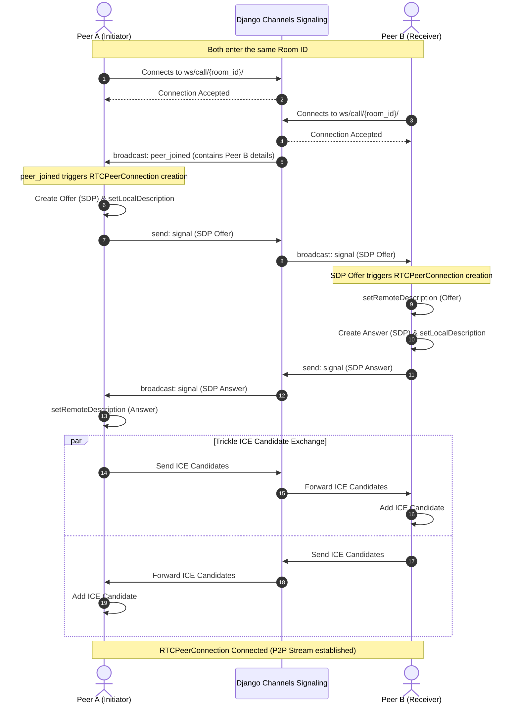

# 🎥 Studio Call - Real-Time WebRTC Video Conferencing

A modern, containerized, real-time peer-to-peer video conferencing application built with **React**, **Django Channels**, **Redis**, and **Nginx**.

This project provides low-latency, real-time video/audio calling between two clients using standard **WebRTC** Peer-to-Peer connections, coordinated through a custom **WebSocket signaling server**.

---

## 🏗️ Architecture Overview

The system consists of four main containerized services managed by Docker Compose:

1. **Frontend (React + Vite)**: Renders a modern lobby camera preview, room-joining interface, and active WebRTC video calling layout.
2. **Backend (Django Channels)**: Acts as the WebRTC signaling mediator via WebSockets, routing SDP offers, answers, and ICE candidates between peers.
3. **Redis**: Acts as the Channel Layer backend (`channels_redis`), allowing different Django ASGI worker processes to exchange WebSocket messages seamlessly.
4. **Nginx**: Operates as a reverse proxy routing incoming client traffic:
   - `/ws/` WebSocket connections are forwarded to the ASGI application.
   - `/api/` and `/admin/` are directed to the Django WSGI/ASGI server.
   - `/static/` serves compiled static files.
   - `/` defaults to the Vite-React frontend web app.

### Connection & Signaling Flow

Below is the lifecycle of a WebRTC connection coordinated by our signaling server:



---

## 🛠️ Tech Stack & Key Files

### Backend
- **Framework**: Django 6.0 (running with Uvicorn/ASGI)
- **Real-Time Communication**: Django Channels 4+
- **Message Broker**: Redis (for channel layers)
- **Key Files**:
  - [settings.py](file:///D:/Code/WebDev/ai/backend/backend/settings.py): Application configuration, including custom `CHANNEL_LAYERS` setup connecting to Redis.
  - [asgi.py](file:///D:/Code/WebDev/ai/backend/backend/asgi.py): ASGI entry point defining routing configuration for HTTP and WebSockets.
  - [routing.py](file:///D:/Code/WebDev/ai/backend/signaling/routing.py): Defines the WebSocket URL pattern `/ws/call/<room_name>/`.
  - [consumers.py](file:///D:/Code/WebDev/ai/backend/signaling/consumers.py): The [VideoCallConsumer](file:///D:/Code/WebDev/ai/backend/signaling/consumers.py#L4-L63) class handling client connections, disconnections, room-based grouping, and message propagation.
  - [requirements.txt](file:///D:/Code/WebDev/ai/backend/requirements.txt): Python dependency lists.

### Frontend
- **Framework**: React 19 + Vite 8
- **Linter**: Oxlint
- **Key Files**:
  - [App.jsx](file:///D:/Code/WebDev/ai/frontend/src/App.jsx): Orchestrates all UI states, WebRTC peer connection configuration (RTCPeerConnection), signaling lifecycle events, and camera/microphone controls.
  - [App.css](file:///D:/Code/WebDev/ai/frontend/src/App.css): Layout styles for lobby preview, video grid, and control panel overlays.
  - [index.css](file:///D:/Code/WebDev/ai/frontend/src/index.css): Core global styles and styling variables.
  - [package.json](file:///D:/Code/WebDev/ai/frontend/package.json): Frontend dependencies.

### Orchestration & Proxy
- [docker-compose.yml](file:///D:/Code/WebDev/ai/docker-compose.yml): Declares all services, volumes, environment configurations, and link dependencies.
- [default.conf](file:///D:/Code/WebDev/ai/nginx/default.conf): Routes Nginx traffic to the proper internal servers (Django vs. React).

---

## 🚀 Getting Started

Ensure you have [Docker](https://www.docker.com/) and [Docker Compose](https://docs.docker.com/compose/) installed on your machine.

### Method 1: Running with Docker Compose (Recommended)

1. Clone the repository and navigate to the project directory:
   ```bash
   cd ai
   ```
2. Build and spin up the containers:
   ```bash
   docker-compose up --build
   ```
3. Once running, access the application in your browser at:
   - **Frontend App**: [http://localhost](http://localhost)
   - **Django Admin Interface**: [http://localhost/admin/](http://localhost/admin/)
4. Open [http://localhost](http://localhost) in two separate browser tabs/devices, enter the same Room ID (e.g. `cozy-room`), and grant camera/mic permissions to start the video call.

### Method 2: Running Locally for Development

If you prefer to run services manually without Docker:

#### 1. Setup Redis
Ensure a Redis instance is running locally on port `6379`. You can run it via Docker:
```bash
docker run -d -p 6379:6379 redis:7-alpine
```

#### 2. Run Django Backend
1. Create a virtual environment and activate it:
   ```bash
   cd backend
   python -m venv .venv
   # On Windows:
   .venv\Scripts\activate
   # On macOS/Linux:
   source .venv/bin/activate
   ```
2. Install dependencies:
   ```bash
   pip install -r requirements.txt
   ```
3. Set environment variables in a `.env` file inside `backend/`:
   ```env
   DEBUG=True
   AIVEN_REDIS_URI=redis://127.0.0.1:6379
   ```
4. Run migrations and start the development server using Uvicorn:
   ```bash
   python manage.py migrate
   python manage.py runserver 8000
   ```

#### 3. Run React Frontend
1. Navigate to the frontend directory:
   ```bash
   cd frontend
   ```
2. Install dependencies:
   ```bash
   npm install
   ```
3. Start the Vite dev server:
   ```bash
   npm run dev
   ```
4. Access the development frontend at the URL printed in your terminal (usually [http://localhost:5173](http://localhost:5173)). Note: To make WebSocket connection hit Django directly, ensure the URL mapping in code or proxy matches.

---

## 📡 WebRTC Signaling Details

The signaling mechanism in [consumers.py](file:///D:/Code/WebDev/ai/backend/signaling/consumers.py) routes JSON payloads between participants in the same channel layer group. The critical messages transmitted are:

- **`peer_joined`**: Sent when a second user connects to the room. The initiator listens for this and triggers the `createOffer` step.
- **`offer`**: Contains the session description (SDP) from the caller. Sent to the receiver to initialize the WebRTC handshake.
- **`answer`**: Contains the session description (SDP) from the receiver, finalizing the remote and local descriptors configuration.
- **`candidate`**: ICE candidate details used by clients to establish connection paths through NATs and firewalls.
- **`peer_left`**: Fired when a peer closes their connection, causing the remaining client to cleanly teardown the active RTCPeerConnection and return to a waiting state.
